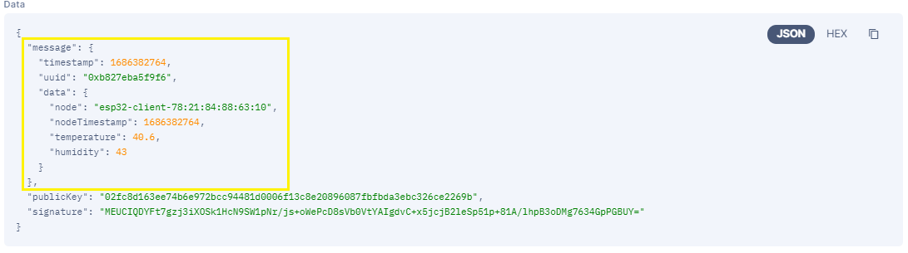

<!-- Title -->
<span align = "center">

# IOTA Websocket

Help the non-supported end-node to connect to IOTA Tangle via websocket.

</span>
<!-- End of Title -->

<!--
<br>
<span align = "center">
   


</span>
<br>
-->


As default, this code work on `Chrysalis Devnet`. If you want to use in production, please install hornet or collaborate with someone who has a hornet API to Chrysalis Mainnet.

## Supported System
- x86_64 (tested)
- Raspberry Pi OS 32-bit (tested)

## Prequerities
- Python 3.x (Python 3.10 is recommended)
- pip

## Install Required Dependency

- Socketio
```
pip install python-socketio
```
- Eventlet
```
pip install eventlet
```

- Digital Signature
```
pip install starkbank-ecdsa
```

## Running on Your System
- Open terminal and clone this repository
```
git clone https://github.com/SuryaAssistant/iota-raspberrypi-gateway
```
- For Raspberry Pi OS 32-bit, go to `armv7l` 
```
cd iota-websocket/armv7l
```
- For x86_64 system (64-bit), go to `x86_64` 
```
cd iota-websocket/x86_64
```
- Run program 
```
python3 main.py
```

## IOTA Websocket Message Syntax
|Feature|Syntax|
|---|---|
| Upload data to IOTA Tangle | `data/{<data>}/<return_sid>/<specified_tag>`|
| Get list of message ID in IOTA Tangle Index | `tag/<tag_index>/<return_sid>` |
| Get full data of message (include indexation, milestone, etc) | `msg_data/<msg_id>/<return_sid>` |
| Get full metadata of message | `msg_metadata/<msg_id>/<return_sid>` |
| Get all message data from all message ID in same tag index | `tag_msg/<tag_index>/<return_sid>` |
| Get all message data from all message ID in same tag index that support JSON compatible format | `tag_msg_json/<tag_index>/<return_sid>` |
| Get filtered message in tag index (only support message with JSON format) | `tag_msg_filter/<tag_index>/<return_sid>/<operator:value>/<key_position>` |
| Get data of message (message, signature and uploader public key) | `payload/<msg_id>/<return_sid>` |
| Get data of message (only message that published via the gateway itself. If not from the gateway, it will return `Not Valid`) | `payload_valid/<msg_id>/<return_sid>` |
| Convert input compressed public key to PEM format | `convert_to_pem/<compressed_public_key>/<return_sid>` |

## Digital Signature for Data Integrity
This project used `secp256k1` elliptic curve to generate private key and public key. We are using python [starkbank-ecdsa](https://github.com/starkbank/ecdsa-python) library to generate and validate digital signature for the data. When you run the main.py for the first time, it will generate private key automatically and store the private key. As long as not re-installed, private key will still remain there.



The data that signatured is in yellow box. The result is in base64 format signature.
Format to validate the signature is defined below

**Data** : `"message":{"timestamp":1686382764,"uuid":"0xb827eba5f9f6","data":{"node":"esp32-client-78:21:84:88:63:10","nodeTimestamp":1686382764,"temperature":40.60,"humidity":43.00}}`
<br>
Data is **without** whitespace


**Public Key (compressed)** : `02fc8d163ee74b6e972bcc94481d0006f13c8e20896087fbfbda3ebc326ce2269b`

**Public Key PEM Format** :
```
-----BEGIN PUBLIC KEY-----
MFYwEAYHKoZIzj0CAQYFK4EEAAoDQgAE/I0WPudLbpcrzJRIHQAG8TyOIIlgh/v7
2j68MmziJpt+3/KrkvZ8CecdV53OXlOLNBRfU7ZtKbRSLOZQPAsBoA==
-----END PUBLIC KEY-----
```

**Signature (base64)** : `MEUCIQDYFt7gzj3iXOSk1HcN9SW1pNr/js+oWePcD8sVb0VtYAIgdvC+x5jcjB2leSp51p+81A/lhpB3oDMg7634GpPGBUY=`

For prooving, you can go [here](https://8gwifi.org/ecsignverify.jsp)

## Automatic Start Up with Systemmd
You can also make this script always running when your machine is starting up. Please follow steps below:

- Create iota-websocket.service
  ```
  sudo nano /etc/systemd/system/iota-websocket.service
  ```

- Add these lines. For raspberry pi, please choose armv7l.

  Please change `<your_machine>` with your machine name and `<python_version>` with python3 that you are using, for example `python3.10`.
   ```
   [Unit]
   Description=IOTA Websocket Service
   After=network.target
   
   [Service]
   User=root
   ExecStart=/usr/bin/python3 /home/<your_machine>/iota-websocket/<choose_armv7l_or_x86_64>/main.py
   Restart=always
   Environment="PYTHONPATH=$PYTHONPATH:/home/surya/.local/lib/<python_version>/site-packages"
   
   [Install]
   WantedBy=multi-user.target
   ```
   
- Save using `CTRL+X`, followed by `Y` and `Enter`
  
- Reload daemon in terminal
  ```
  sudo systemtl daemon-reload
  ```
  
- Enable service
  ```
  sudo systemctl enable iota-websocket.service
  ```
  
- Start iota-websocket
  ```
  sudo systemctl start iota-websocket.service
  ```
  
